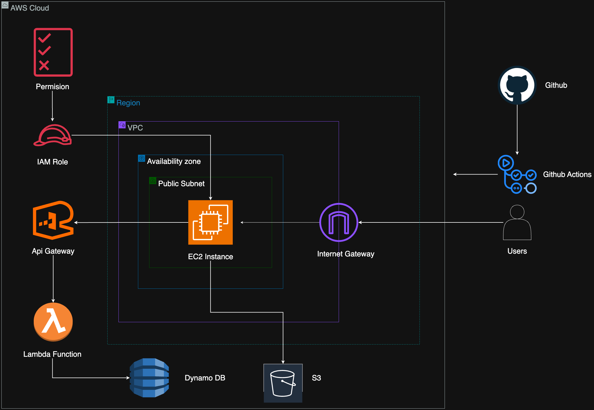

# Dagmar Lewis's Personal Portfolio Website

This repository contains the source code for my personal portfolio website, dagmarlewis.com. It's a full-stack application showcasing my projects, blog posts, and skills. The website is designed to be a modern, responsive, and performant platform to share my work and experiences.
# Architecture
 
## Live Website

You can visit the live website at [dagmarlewis.com](https://www.dagmarlewis.com).

## Tech Stack

The project is built with a modern tech stack, leveraging the best of breed tools for frontend development, backend services, and infrastructure as code.

### Frontend

*   **Framework**: [Next.js](https.nextjs.org/) (with App Router)
*   **Language**: [TypeScript](https://www.typescriptlang.org/)
*   **Styling**: [Tailwind CSS](https://tailwindcss.com/)
*   **UI Components**: [Shadcn UI](https://ui.shadcn.com/)
*   **Content**: [MDX](https://mdxjs.com/) with [Velite](https://velite.js.org/) for content management
*   **Deployment**: [Vercel](https://vercel.com/)

### Backend

*   **Runtime**: [Node.js](https://nodejs.org/)
*   **Framework**: [AWS Lambda](https://aws.amazon.com/lambda/)
*   **Database**: [Amazon DynamoDB](https://aws.amazon.com/dynamodb/)
*   **API**: [Amazon API Gateway](https://aws.amazon.com/api-gateway/)

### Infrastructure & DevOps

*   **Infrastructure as Code**: [Terraform](https://www.terraform.io/)
*   **CI/CD**: [GitHub Actions](https://github.com/features/actions)
*   **Containerization**: [Docker](https://www.docker.com/)
*   **Hosting**: [Amazon Web Services (AWS)](https://aws.amazon.com/)

## Features

*   **Portfolio Showcase**: A dedicated section to feature my projects with detailed descriptions and links.
*   **Blog**: A blog with articles on various tech topics, written in MDX.
*   **Visitor Counter**: A backend service that counts the number of unique visitors to the site.
*   **Responsive Design**: The website is fully responsive and works on all devices.
*   **Dark Mode**: A theme toggler to switch between light and dark mode.
*   **RSS Feed**: An RSS feed for the blog is available at `/feed.xml`.

## Project Structure

The repository is organized into three main directories:

*   `frontend/`: The Next.js application that constitutes the main website.
*   `backend/`: An AWS Lambda function that acts as a visitor counter.
*   `ops/`: Terraform code for provisioning the AWS infrastructure and CI/CD scripts.

## Getting Started

To run the frontend application locally, you'll need to have [Node.js](https://nodejs.org/) and [Bun](https://bun.sh/) installed.

1.  **Clone the repository:**

    ```bash
    git clone https://github.com/dagmarlewis/dagmarlewis.com.git
    cd dagmarlewis.com/frontend
    ```

2.  **Install dependencies:**

    ```bash
    bun install
    ```

3.  **Run the development server:**

    ```bash
    bun run dev
    ```

    The website will be available at `http://localhost:3000`.

## Deployment

The website is automatically deployed to AWS using a CI/CD pipeline powered by GitHub Actions. The pipeline is defined in the `.github/workflows/` directory.

The infrastructure is provisioned using Terraform, with the code located in the `ops/terraform/` directory. To deploy the infrastructure, run the following commands from the `ops/terraform` directory:

```bash
terraform init
terraform apply
```

The Terraform setup includes:

*   A custom VPC with public and private subnets.
*   An EC2 instance to host the Next.js application in a Docker container.
*   An S3 bucket for storing Terraform state and other files.
*   An ECR repository to store the Docker image.
*   An API Gateway and Lambda function for the visitor counter.

The `ops/README.md` file contains more detailed information about the infrastructure and deployment process.