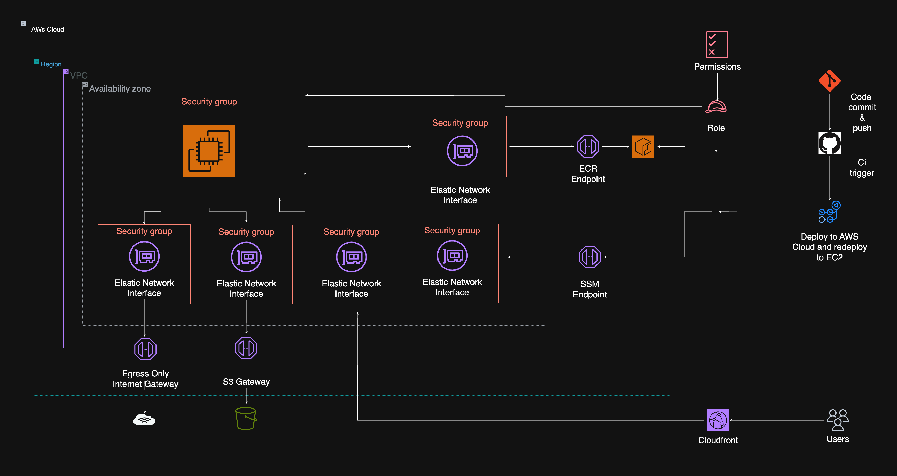

### Architecture

Below is the architecture of this project. Click [here](./assets/portfolio-website/infrastructure.png) to access the diagram in detail.

  
  



  
  

## **Implementation**

  

### **Containerizing The Nextjs Application With Docker**

  

To ensure consistency across different environments, I containerized the Next.js frontend using Docker. This eliminated dependency issues and allowed smooth deployment across local and cloud environments.

  

### **Setting Up The Docker Environment**

I created the Dockerfile for the Nextjs app by using a multi-stage build to keep the final image lightweight while ensuring an optimal production build.Here's the Dockerfile:

```yml

FROM oven/bun:canary-alpine AS base

  

WORKDIR /usr/src/app

  

# install dependencies into temp directory

# this will cache them and speed up future builds

  

FROM base AS install

RUN mkdir -p /temp/prod

COPY package*.json bun.lockb /temp/prod/

RUN cd /temp/prod && bun install --frozen-lockfile

  
  

# copy node_modules from temp directory

# then copy all (non-ignored) project files into the image

FROM base AS builder

COPY --from=install /temp/prod/node_modules node_modules

COPY . .

  
  

RUN bun run build

  

FROM base AS runner

WORKDIR /usr/src/app

  
  

COPY --from=builder --chown=bun:bun /usr/src/app/.next/standalone ./

  

# Automatically leverage output traces to reduce image size

# https://nextjs.org/docs/advanced-features/output-file-tracing

  

COPY --from=builder --chown=bun:bun /usr/src/app/.next/static ./.next/static

COPY --from=builder --chown=bun:bun /usr/src/app/public ./public

  

USER bun

EXPOSE 3000/tcp

# server.js is created by next build from the standalone output

# https://nextjs.org/docs/pages/api-reference/config/next-config-js/output

CMD ["bun", "server.js" ]

```

  

#### **Why this setup?**

- **Multi-stage build:** Keeps the final image lightweight by only including necessary files.

  

- **Alpine-based Bun image:** Reduces image size while maintaining compatibility.

  

- **Port 3000 exposed:** To match Next.js default behavior.

  

#### **Managing Services With Docker Compose**

Instead of starting each container manually, I created a **docker-compose.yml** file to orchestrate all services,including the Nextjs app and Caddy proxy.

  

```yml

networks:

proxy-network:

external: true

services:

Portfolio:

container_name: portfolio

image: 464858727777.dkr.ecr.us-east-1.amazonaws.com/dagmarlewis_portfolio:latest

expose:

- "3000:3000"

restart: unless-stopped

  

networks:

- proxy-network

  
  

caddy:

container_name: caddy

image: caddy:latest

ports:

- "80:80"

- "443:443"

volumes:

- ./data:/data

- ./config:/config

- ./Caddyfile:/etc/caddy/Caddyfile:ro

  

restart: unless-stopped

  

networks:

- proxy-network

```

#### Caddy file for the caddy container

The caddy container needed a Caddyfile so it knows where to redirect traffic to

```json

:80 {

reverse_proxy portfolio:3000

}

```

#### Why This Approach?

  

- **Caddy for reverse proxy:** It routes traffic from port:80 over the proxy network to the application

  

- **Proxy network:** Isolates traffic from the general system

  

#### Running The Containers

After writing the docker-compose.yml file I started all services with

```bash

docker compose up -d

```

This automatically:

- Starts the nextjs container and caddy container.

- Ensures everything runs in detached mode (-d).

  

At this point, the application was accessible at http://localhost

### **Infrastructure as Code (IaC) with Terraform**

For infrastructure provisioning, I used Terraform to ensure my cloud resources were managed efficiently and reproducibly. Instead of manually configuring services, Terraform allowed me to define everything as code, making deployments consistent.

**Why Terraform?**
-  **Infrastructure as Code (IaC)**: Enables automation and avoids manual setup errors.
-  **Modularity**: Resources can be structured into reusable modules.
-  **State Management**: Keeps track of infrastructure changes
-  **Multi-Cloud Support**: Can be extended beyond AWS if needed.

I deployed the following AWS resources

 #### 1 **Amazon S3 for storage**

I used **AmazonS3** to store the docker-compose.yml file, Caddyfile and the redeployment.sh

 #### 2 **Amazon ECR for Container Image Storage**

Since I containerized my application using Docker, I needed a secure registry to store and manage images. **Amazon Elastic Container Registry (ECR)** was the best choice because it integrates seamlessly with AWS services and simplifies authentication via IAM roles.

```tf
resource "aws_ecr_repository" "dagmarlewis_portfolio" {

name = var.ecr_repo_name

image_tag_mutability = "MUTABLE"

  

image_scanning_configuration {

scan_on_push = true

}

}
```

 #### 3 **Amazon EC2 For Compute**

While ECS or EKS could be alternatives, I opted for **EC2** instances to run my containers for simplicity and flexibility. EC2 gives me full control over the underlying infrastructure, making it easier to customize the deployment environment.

```tf
resource "aws_instance" "instance" {

ami = var.ami

instance_type = var.instance_type

subnet_id = aws_subnet.private_subnet.id

security_groups = [aws_security_group.allow_cloudfront_managed.id, aws_security_group.ssm_sg.id, aws_security_group.egress_endpoint_sg.id, aws_security_group.s3_endpoint.id, aws_security_group.ecr_endpoint.id]

iam_instance_profile = aws_iam_instance_profile.ec2_profile.name

  

user_data = <<-EOF

#!/bin/bash

sudo apt-get update

sudo apt upgrade -y

sudo usermod -a -G docker

sudo apt install -y ca-certificates curl gnupg lsb-release

sudo mkdir -p /etc/apt/keyrings

curl -fsSL https://download.docker.com/linux/ubuntu/gpg | sudo gpg --dearmor -o /etc/apt/keyrings/docker.gpg

sudo echo "deb [arch=$(dpkg --print-architecture) signed-by=/etc/apt/keyrings/docker.gpg] https://download.docker.com/linux/ubuntu $(lsb_release -cs) stable" | sudo tee /etc/apt/sources.list.d/docker.list > /dev/null

sudo apt update

sudo apt install -y docker-ce docker-ce-cli containerd.io docker-compose-plugin

sudo service docker start

sudo apt install unzip

curl "https://awscli.amazonaws.com/awscli-exe-linux-x86_64.zip" -o "awscliv2.zip"

unzip awscliv2.zip

sudo ./aws/install

cd /home/ubuntu

mkdir caddy

cd caddy

mkdir data config

sudo aws s3 cp s3://dagmarlewis.com-tf-files/Caddyfile .

sudo aws s3 cp s3://dagmarlewis.com-tf-files/docker-compose.yml .

aws ecr get-login-password --region us-east-1| sudo docker login --username AWS --password-stdin 464858727777.dkr.ecr.us-east-1.amazonaws.com/dagmarlewis_portfolio

sudo docker network create proxy-network

sudo docker compose up -d

  

EOF

tags = {

Name = "${var.project_name}_instance"

}

}
```

 #### 4 **Amazon Cloudfront For Public Access**
```tf
resource "aws_cloudfront_vpc_origin" "ec2e" {

vpc_origin_endpoint_config {

name = var.project_name

arn = aws_instance.instance.arn

http_port = 80

https_port = 443

origin_protocol_policy = "http-only"

  

origin_ssl_protocols {

items = ["TLSv1.2"]

quantity = 1

}

}

}

  
  

resource "aws_cloudfront_distribution" "vpc_origin_distribution" {

enabled = var.cloudfront_distrubution_state

retain_on_delete = false

  

origin {

vpc_origin_config {

vpc_origin_id = aws_cloudfront_vpc_origin.ec2e.id

}

domain_name = aws_instance.instance.private_dns

origin_id = aws_cloudfront_vpc_origin.ec2e.id

}

  

default_cache_behavior {

allowed_methods = ["GET", "HEAD"]

cached_methods = ["GET", "HEAD"]

target_origin_id = aws_cloudfront_vpc_origin.ec2e.id

cache_policy_id = "4135ea2d-6df8-44a3-9df3-4b5a84be39ad" # cache policy managed disable

origin_request_policy_id = "216adef6-5c7f-47e4-b989-5492eafa07d3" # managed all viewer

viewer_protocol_policy = "allow-all"

min_ttl = 0

default_ttl = 0

max_ttl = 0

}

  
  
  

restrictions {

geo_restriction {

restriction_type = "none"

locations = []

}

}

  

viewer_certificate {

cloudfront_default_certificate = true

}

  

}
```


 #### 5 **VPC Endpoints**
Since the EC2 Instance is in a private subnet Endpoints are required for it to communicate with AWS services and the Internet
###### 1 **Egress Endpoint**

This enables the EC2 instances to gain access to the internet through Egress only so the instance only communicates to the internet and not the public internet to it so it can download the required applications and system updates.

```tf
resource "aws_security_group" "egress_endpoint_sg" {

name = "Allow egress endpoint"

description = "Allow traffic from egress endpoint"

vpc_id = aws_vpc.main_vpc.id

  

egress {

from_port = 0

to_port = 0

protocol = "-1"

ipv6_cidr_blocks = ["::/0"]

  

description = "allow outbound traffic"

}

  

tags = {

Name = "${var.project_name}_egress_sg"

}

}
```

###### 2 **Endpoints for AWS Session Manager**

Aws Session Manager requires 3 endpoints

```tf
resource "aws_vpc_endpoint" "ssm" {

vpc_id = aws_vpc.main_vpc.id

service_name = "com.amazonaws.us-east-1.ssm"

vpc_endpoint_type = "Interface"

subnet_ids = [aws_subnet.private_subnet.id]

security_group_ids = [aws_security_group.ssm_sg.id]

private_dns_enabled = true

  

tags = {

Name = "${var.project_name}_ssm_endpoint"

}

}
```

```
resource "aws_vpc_endpoint" "ec2messages" {

vpc_id = aws_vpc.main_vpc.id

service_name = "com.amazonaws.us-east-1.ec2messages"

vpc_endpoint_type = "Interface"

subnet_ids = [aws_subnet.private_subnet.id]

security_group_ids = [aws_security_group.ssm_sg.id]

private_dns_enabled = true

  

tags = {

Name = "${var.project_name}_ec2messages_endpoint"

}

}
```

```
resource "aws_vpc_endpoint" "messages" {

vpc_id = aws_vpc.main_vpc.id

service_name = "com.amazonaws.us-east-1.ssmmessages"

vpc_endpoint_type = "Interface"

subnet_ids = [aws_subnet.private_subnet.id]

security_group_ids = [aws_security_group.ssm_sg.id]

private_dns_enabled = true

  

tags = {

Name = "${var.project_name}_messages_endpoint"

}

}
```

###### 3 **S3 Endpoint**
```
resource "aws_vpc_endpoint" "s3" {

vpc_id = aws_vpc.main_vpc.id

service_name = "com.amazonaws.us-east-1.s3"

vpc_endpoint_type = "Gateway"

route_table_ids = [aws_route_table.private_route_table.id]

tags = {

Name = "${var.project_name}_s3_endpoint"

}

}
```

###### 4 **ECR Endpoints**
 ECR Requires 2 endpoint
```
resource "aws_vpc_endpoint" "ecr_api" {

vpc_id = aws_vpc.main_vpc.id

service_name = "com.amazonaws.us-east-1.ecr.api"

vpc_endpoint_type = "Interface"

subnet_ids = [aws_subnet.private_subnet.id]

security_group_ids = [aws_security_group.ecr_endpoint.id]

private_dns_enabled = true

  

tags = {

Name = "${var.project_name}_ecr_endpoint"

}

}
```

```
resource "aws_vpc_endpoint" "ecr_docker" {

vpc_id = aws_vpc.main_vpc.id

service_name = "com.amazonaws.us-east-1.ecr.dkr"

vpc_endpoint_type = "Interface"

subnet_ids = [aws_subnet.private_subnet.id]

security_group_ids = [aws_security_group.ecr_endpoint.id]

private_dns_enabled = true

  

tags = {

Name = "${var.project_name}_ecr_endpoint"

}

}
```
### **Automating Infrastructure Deployment And Application Deployment Using Github Actions**